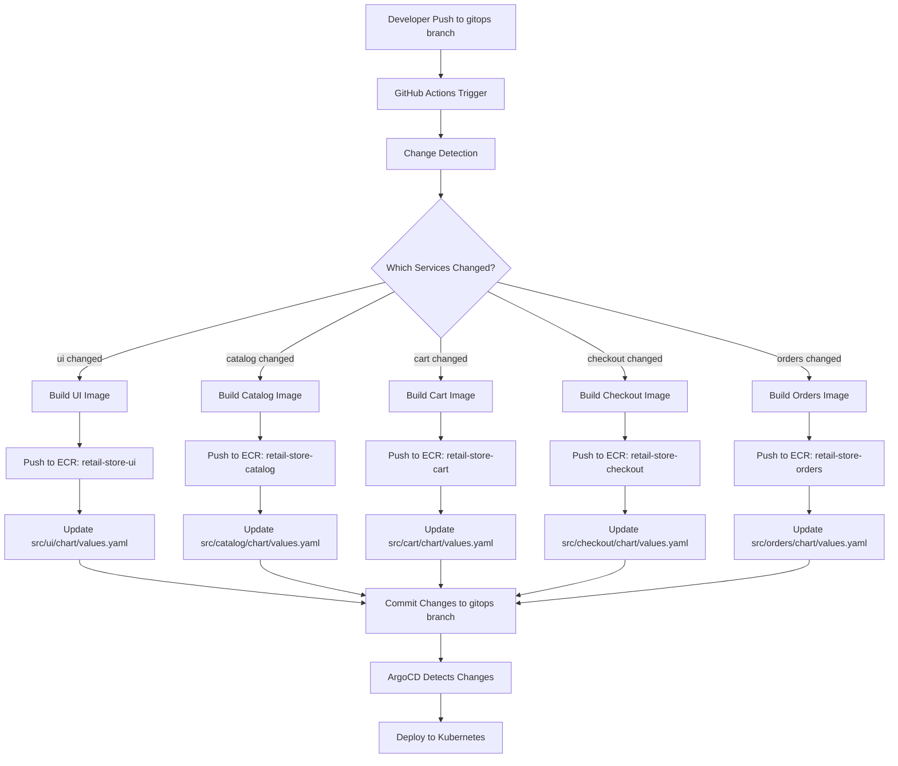

# Design Document: GitHub Actions CI/CD Workflow

## Overview

This design document outlines the implementation of a GitHub Actions CI/CD workflow for the retail store sample application. The workflow automates the complete deployment pipeline from code commit to Kubernetes-ready artifacts by detecting changes in microservices, building Docker images, pushing them to Amazon ECR, and updating Helm chart configurations for GitOps-based deployments.

The solution follows a microservices architecture with five independent services (ui, catalog, cart, checkout, orders), each with its own build process and deployment configuration. The workflow optimizes build times through intelligent change detection and parallel execution while maintaining consistency across all services.

## Architecture

### High-Level Workflow Architecture



### Workflow Execution Flow

1. **Trigger Phase**: Workflow activates on push to gitops branch or manual dispatch
2. **Detection Phase**: Identifies changed microservices by analyzing modified file paths
3. **Build Phase**: Constructs Docker images for changed services in parallel
4. **Push Phase**: Authenticates with ECR and uploads images with commit-based tags
5. **Update Phase**: Modifies Helm chart values.yaml files with new image references
6. **Commit Phase**: Pushes updated configurations back to repository
7. **Sync Phase**: ArgoCD automatically detects and deploys changes

## Components and Interfaces

### 1. Workflow File Structure

**Location**: `.github/workflows/deploy.yml`

**Trigger Configuration**:
```yaml
on:
  push:
    branches:
      - gitops
    paths:
      - 'src/**'
  workflow_dispatch:
```

**Environment Variables**:
- `AWS_REGION`: Sourced from GitHub secrets
- `AWS_ACCOUNT_ID`: Sourced from GitHub secrets
- `COMMIT_HASH`: Derived from `github.sha` (first 7 characters)
- `ECR_REGISTRY`: Computed as `${AWS_ACCOUNT_ID}.dkr.ecr.${AWS_REGION}.amazonaws.com`

### 2. Change Detection Component

**Purpose**: Identify which microservices have code changes to optimize build process

**Implementation Strategy**:
```yaml
- name: Detect changed services
  id: changes
  run: |
    if [ "${{ github.event_name }}" == "workflow_dispatch" ]; then
      echo "build_ui=true" >> $GITHUB_OUTPUT
      echo "build_catalog=true" >> $GITHUB_OUTPUT
      echo "build_cart=true" >> $GITHUB_OUTPUT
      echo "build_checkout=true" >> $GITHUB_OUTPUT
      echo "build_orders=true" >> $GITHUB_OUTPUT
    else
      git fetch origin ${{ github.event.before }}
      CHANGED_FILES=$(git diff --name-only ${{ github.event.before }} ${{ github.sha }})
      
      echo "$CHANGED_FILES" | grep -q "^src/ui/" && echo "build_ui=true" >> $GITHUB_OUTPUT || echo "build_ui=false" >> $GITHUB_OUTPUT
      echo "$CHANGED_FILES" | grep -q "^src/catalog/" && echo "build_catalog=true" >> $GITHUB_OUTPUT || echo "build_catalog=false" >> $GITHUB_OUTPUT
      echo "$CHANGED_FILES" | grep -q "^src/cart/" && echo "build_cart=true" >> $GITHUB_OUTPUT || echo "build_cart=false" >> $GITHUB_OUTPUT
      echo "$CHANGED_FILES" | grep -q "^src/checkout/" && echo "build_checkout=true" >> $GITHUB_OUTPUT || echo "build_checkout=false" >> $GITHUB_OUTPUT
      echo "$CHANGED_FILES" | grep -q "^src/orders/" && echo "build_orders=true" >> $GITHUB_OUTPUT || echo "build_orders=false" >> $GITHUB_OUTPUT
    fi
```

**Outputs**:
- `build_ui`: Boolean flag for UI service
- `build_catalog`: Boolean flag for Catalog service
- `build_cart`: Boolean flag for Cart service
- `build_checkout`: Boolean flag for Checkout service
- `build_orders`: Boolean flag for Orders service

### 3. Docker Build and Push Component

**Service Configuration Matrix**:

| Service | Dockerfile Path | ECR Repository | Build Context |
|---------|----------------|----------------|---------------|
| UI | `src/ui/Dockerfile` | `retail-store-ui` | `src/ui` |
| Catalog | `src/catalog/Dockerfile` | `retail-store-catalog` | `src/catalog` |
| Cart | `src/cart/Dockerfile` | `retail-store-cart` | `src/cart` |
| Checkout | `src/checkout/Dockerfile` | `retail-store-checkout` | `src/checkout` |
| Orders | `src/orders/Dockerfile` | `retail-store-orders` | `src/orders` |

**Build Job Template** (example for UI service):
```yaml
build-ui:
  runs-on: ubuntu-latest
  needs: detect-changes
  if: needs.detect-changes.outputs.build_ui == 'true'
  steps:
    - name: Checkout code
      uses: actions/checkout@v4
      
    - name: Configure AWS credentials
      uses: aws-actions/configure-aws-credentials@v4
      with:
        aws-access-key-id: ${{ secrets.AWS_ACCESS_KEY_ID }}
        aws-secret-access-key: ${{ secrets.AWS_SECRET_ACCESS_KEY }}
        aws-region: ${{ secrets.AWS_REGION }}
    
    - name: Login to Amazon ECR
      id: login-ecr
      uses: aws-actions/amazon-ecr-login@v2
    
    - name: Create ECR repository if not exists
      run: |
        aws ecr describe-repositories --repository-names retail-store-ui || \
        aws ecr create-repository --repository-name retail-store-ui
    
    - name: Build and push Docker image
      env:
        ECR_REGISTRY: ${{ steps.login-ecr.outputs.registry }}
        IMAGE_TAG: ${{ github.sha }}
      run: |
        SHORT_SHA=$(echo $IMAGE_TAG | cut -c1-7)
        docker build -t $ECR_REGISTRY/retail-store-ui:$SHORT_SHA src/ui
        docker push $ECR_REGISTRY/retail-store-ui:$SHORT_SHA
        echo "Pushed image: $ECR_REGISTRY/retail-store-ui:$SHORT_SHA"
```

**Parallel Execution**: All build jobs run concurrently to minimize total pipeline time

### 4. Helm Chart Update Component

**Purpose**: Update values.yaml files with new image references while preserving infrastructure configurations

**Update Strategy**:
```yaml
update-helm-charts:
  runs-on: ubuntu-latest
  needs: [build-ui, build-catalog, build-cart, build-checkout, build-orders]
  if: always() && (needs.build-ui.result == 'success' || needs.build-catalog.result == 'success' || needs.build-cart.result == 'success' || needs.build-checkout.result == 'success' || needs.build-orders.result == 'success')
  steps:
    - name: Checkout code
      uses: actions/checkout@v4
      with:
        token: ${{ secrets.GITHUB_TOKEN }}
        fetch-depth: 0
    
    - name: Update Helm values
      run: |
        SHORT_SHA=$(echo ${{ github.sha }} | cut -c1-7)
        ECR_REGISTRY="${{ secrets.AWS_ACCOUNT_ID }}.dkr.ecr.${{ secrets.AWS_REGION }}.amazonaws.com"
        
        # Function to update values.yaml
        update_values() {
          local service=$1
          local values_file="src/$service/chart/values.yaml"
          
          if [ -f "$values_file" ]; then
            # Update only the main image section, preserve infrastructure images
            awk -v repo="$ECR_REGISTRY/retail-store-$service" -v tag="$SHORT_SHA" '
            BEGIN { in_main_image = 0; updated_repo = 0; updated_tag = 0 }
            /^image:/ { in_main_image = 1 }
            in_main_image && /^  repository:/ && !updated_repo {
              print "  repository: " repo
              updated_repo = 1
              next
            }
            in_main_image && /^  tag:/ && !updated_tag {
              print "  tag: \"" tag "\""
              updated_tag = 1
              next
            }
            /^[a-zA-Z]/ && !/^image:/ { in_main_image = 0 }
            { print }
            ' "$values_file" > "$values_file.tmp"
            mv "$values_file.tmp" "$values_file"
            echo "Updated $values_file"
          fi
        }
        
        # Update each service if it was built
        [ "${{ needs.build-ui.result }}" == "success" ] && update_values "ui"
        [ "${{ needs.build-catalog.result }}" == "success" ] && update_values "catalog"
        [ "${{ needs.build-cart.result }}" == "success" ] && update_values "cart"
        [ "${{ needs.build-checkout.result }}" == "success" ] && update_values "checkout"
        [ "${{ needs.build-orders.result }}" == "success" ] && update_values "orders"
    
    - name: Commit and push changes
      run: |
        git config user.name "github-actions[bot]"
        git config user.email "github-actions[bot]@users.noreply.github.com"
        git add src/*/chart/values.yaml
        git commit -m "Update Helm charts with images from commit ${SHORT_SHA}" || echo "No changes to commit"
        git push
```

**AWK Script Logic**:
- Tracks state with `in_main_image` flag to identify the primary image section
- Updates `repository` and `tag` fields only once per file
- Preserves all other YAML content including infrastructure images (mysql, redis, etc.)
- Maintains proper YAML indentation and formatting

### 5. Git Operations Component

**Authentication**: Uses `GITHUB_TOKEN` for repository access

**Configuration**:
```yaml
git config user.name "github-actions[bot]"
git config user.email "github-actions[bot]@users.noreply.github.com"
```

**Commit Message Format**:
```
Update Helm charts with images from commit <7-char-hash>
```

**Push Strategy**: Direct push to gitops branch (no pull request required)

## Data Models

### GitHub Actions Outputs

```yaml
detect-changes:
  outputs:
    build_ui: ${{ steps.changes.outputs.build_ui }}
    build_catalog: ${{ steps.changes.outputs.build_catalog }}
    build_cart: ${{ steps.changes.outputs.build_cart }}
    build_checkout: ${{ steps.changes.outputs.build_checkout }}
    build_orders: ${{ steps.changes.outputs.build_orders }}
```

### Image Tag Format

```
Pattern: {AWS_ACCOUNT_ID}.dkr.ecr.{REGION}.amazonaws.com/{SERVICE_NAME}:{COMMIT_HASH}
Example: 123456789012.dkr.ecr.us-west-2.amazonaws.com/retail-store-ui:abc1234
```

### Helm Values Structure

```yaml
image:
  repository: <ECR_REGISTRY>/<SERVICE_NAME>  # Updated by workflow
  pullPolicy: Always                          # Preserved
  tag: "<COMMIT_HASH>"                        # Updated by workflow

# Infrastructure images (preserved by workflow)
mysql:
  image:
    repository: public.ecr.aws/docker/library/mysql
    tag: "8.0"

redis:
  image:
    repository: public.ecr.aws/docker/library/redis
    tag: "6.0-alpine"
```

## Error Handling

### Build Failures

**Detection**: Each build job has explicit failure conditions
```yaml
if: failure()
```

**Response**:
1. Workflow marks job as failed
2. Subsequent jobs are skipped (except those with `if: always()`)
3. GitHub Actions UI displays error logs
4. No Helm chart updates occur for failed builds

### ECR Push Failures

**Scenarios**:
- Authentication failure: Invalid AWS credentials
- Network timeout: Retry with exponential backoff (handled by AWS CLI)
- Repository creation failure: Insufficient IAM permissions

**Mitigation**:
```yaml
- name: Create ECR repository if not exists
  run: |
    aws ecr describe-repositories --repository-names retail-store-ui 2>/dev/null || \
    aws ecr create-repository --repository-name retail-store-ui --region ${{ secrets.AWS_REGION }}
```

### Helm Update Failures

**Scenarios**:
- File not found: Service directory structure changed
- AWK parsing error: Malformed YAML

**Mitigation**:
```bash
if [ -f "$values_file" ]; then
  # Perform update
else
  echo "Warning: $values_file not found, skipping"
fi
```

### Git Push Failures

**Scenarios**:
- Merge conflicts: Another commit pushed simultaneously
- Permission denied: Invalid GITHUB_TOKEN

**Mitigation**:
```yaml
- name: Commit and push changes
  run: |
    git pull --rebase origin gitops
    git add src/*/chart/values.yaml
    git commit -m "Update Helm charts" || echo "No changes to commit"
    git push || (git pull --rebase && git push)
```

## Testing Strategy

### Unit Testing (Pre-Implementation)

**Change Detection Logic**:
- Test with single service change
- Test with multiple service changes
- Test with no changes in src/ directory
- Test with workflow_dispatch trigger

**AWK Script Validation**:
- Test with standard values.yaml format
- Test with infrastructure images present
- Test with missing image sections
- Verify YAML structure preservation

### Integration Testing

**End-to-End Workflow**:
1. Create test branch from gitops
2. Modify single service (e.g., src/ui/README.md)
3. Push and verify workflow triggers
4. Confirm only UI service builds
5. Verify ECR image exists with correct tag
6. Confirm values.yaml updated correctly
7. Verify ArgoCD detects change

**Multi-Service Testing**:
1. Modify multiple services simultaneously
2. Verify parallel builds execute
3. Confirm all values.yaml files updated
4. Verify single commit contains all changes

### Manual Testing Checklist

- [ ] Workflow triggers on push to gitops branch
- [ ] Workflow triggers on manual dispatch
- [ ] Change detection identifies correct services
- [ ] Docker images build successfully
- [ ] ECR repositories created automatically
- [ ] Images pushed with correct tags
- [ ] values.yaml files updated correctly
- [ ] Infrastructure images preserved
- [ ] Git commit created with proper message
- [ ] Changes pushed to gitops branch
- [ ] ArgoCD syncs applications

### Validation Commands

```bash
# Verify ECR image exists
aws ecr describe-images --repository-name retail-store-ui --image-ids imageTag=abc1234

# Check values.yaml content
cat src/ui/chart/values.yaml | grep -A 3 "^image:"

# Verify git history
git log --oneline -n 5

# Check ArgoCD sync status
kubectl get applications -n argocd
```

## Security Considerations

### Secrets Management

**Required Secrets**:
- `AWS_ACCESS_KEY_ID`: IAM user access key
- `AWS_SECRET_ACCESS_KEY`: IAM user secret key
- `AWS_REGION`: Target AWS region
- `AWS_ACCOUNT_ID`: AWS account identifier

**Storage**: GitHub repository secrets (encrypted at rest)

**Access**: Limited to workflow execution context

### IAM Permissions

**Minimum Required Policy**:
```json
{
  "Version": "2012-10-17",
  "Statement": [
    {
      "Effect": "Allow",
      "Action": [
        "ecr:GetAuthorizationToken"
      ],
      "Resource": "*"
    },
    {
      "Effect": "Allow",
      "Action": [
        "ecr:BatchCheckLayerAvailability",
        "ecr:GetDownloadUrlForLayer",
        "ecr:BatchGetImage",
        "ecr:InitiateLayerUpload",
        "ecr:UploadLayerPart",
        "ecr:CompleteLayerUpload",
        "ecr:PutImage",
        "ecr:CreateRepository",
        "ecr:DescribeRepositories"
      ],
      "Resource": "arn:aws:ecr:*:*:repository/retail-store-*"
    }
  ]
}
```

### Image Security

**Scanning**: Enable ECR image scanning on push
```bash
aws ecr put-image-scanning-configuration \
  --repository-name retail-store-ui \
  --image-scanning-configuration scanOnPush=true
```

**Immutability**: Consider enabling tag immutability for production
```bash
aws ecr put-image-tag-mutability \
  --repository-name retail-store-ui \
  --image-tag-mutability IMMUTABLE
```

## Performance Optimization

### Parallel Execution

**Strategy**: All build jobs run concurrently using GitHub Actions matrix strategy alternative

**Expected Time Savings**:
- Sequential: ~15 minutes (5 services × 3 minutes each)
- Parallel: ~3-5 minutes (longest build + overhead)

### Docker Layer Caching

**Implementation**: Use GitHub Actions cache for Docker layers
```yaml
- name: Set up Docker Buildx
  uses: docker/setup-buildx-action@v3

- name: Cache Docker layers
  uses: actions/cache@v3
  with:
    path: /tmp/.buildx-cache
    key: ${{ runner.os }}-buildx-${{ github.sha }}
    restore-keys: |
      ${{ runner.os }}-buildx-
```

### Conditional Execution

**Benefit**: Skip unchanged services to reduce compute time and costs

**Implementation**: Job-level conditionals based on change detection outputs
```yaml
if: needs.detect-changes.outputs.build_ui == 'true'
```

## Deployment Considerations

### ArgoCD Integration

**Sync Policy**: Automatic sync enabled for gitops branch applications

**Sync Frequency**: Default 3-minute polling interval

**Health Checks**: ArgoCD monitors pod status and readiness probes

### Rollback Strategy

**Git-Based Rollback**:
```bash
# Revert to previous commit
git revert HEAD
git push origin gitops

# ArgoCD automatically syncs to previous state
```

**Manual Rollback**:
```bash
# Update values.yaml to previous image tag
# Commit and push changes
```

### Monitoring

**Workflow Metrics**:
- Build duration per service
- Success/failure rates
- ECR push times

**Application Metrics**:
- ArgoCD sync status
- Pod health and readiness
- Application logs via CloudWatch

## Future Enhancements

1. **Multi-Environment Support**: Extend workflow to support dev, staging, prod branches
2. **Automated Testing**: Integrate unit and integration tests before build
3. **Slack Notifications**: Send deployment notifications to team channels
4. **Semantic Versioning**: Generate semantic version tags based on commit messages
5. **Rollback Automation**: Automatic rollback on failed health checks
6. **Cost Optimization**: Implement ECR lifecycle policies to remove old images
7. **Security Scanning**: Integrate Trivy or Snyk for vulnerability scanning
8. **Performance Testing**: Run load tests before production deployment
